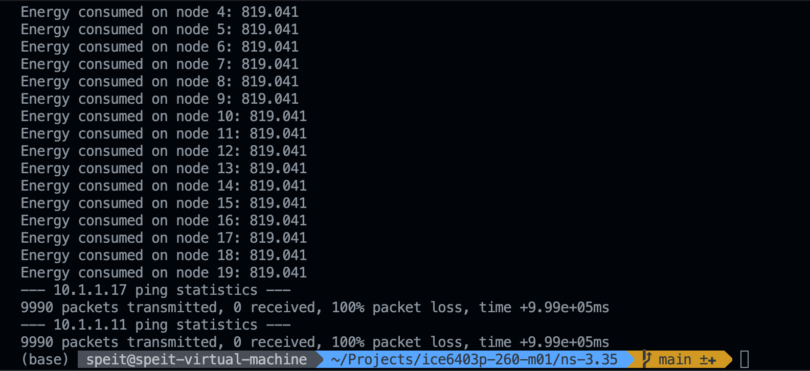
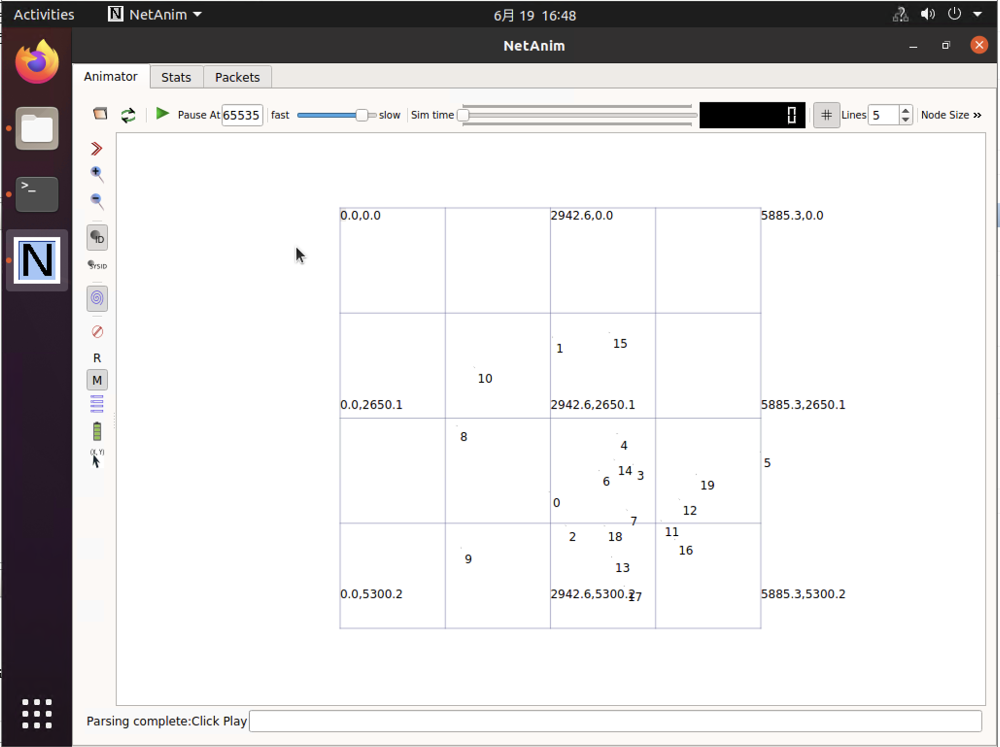

# ICE6403P IoT Design

## Introduction

The main objectives of this project are

- Design a wireless network simulator based on NS-3
- Test the effect of different network parameters and configurations on the simulated network on the basis of the simulator

## Simulator Specs

The simulator must collect the following data so that they could be analyzed and optimized

- [ ] Overall transmission speed and individual transmission rate for each drone
- [ ] Maximum transmission range for each drone
- [ ] Packet loss rate for each drone
- [ ] Energy consumed for each drone
- [ ] Average delay for packet to arrive at their destination
- [ ] Number of online node(drones) at any time

## Drone Limits

Before going any further, we decided to research commercially available drones to ensure that our simulations were realistic. The subject of our research was the DJI Matrice M30, a production quadcopter drone for industrial users. The drone weighs 3.7kg with batteries installed

### Data Rate

The DJI Matrice 30 carries a 1920x1080@30Hz flight camera, as well as optional workloads. The drone has no limits on workloads, so they can be HD cameras, IR cameras or even radar. It is almost impossible to stream this huge data in live. A more reasonable requirement is to return the video stream from the flight camera in real time. As a rule of thumb, such a video stream requires about 1Mbps of bandwidth.

### Transmission Limit

The DJI Matrice 30 drone is equipped with a Wi-Fi 6 module. The radiation power of this module is:

| Band   | Power |
| ------ | ----- |
| 2.4GHz | 26dBm |
| 5.1GHz | 26dBm |
| 5.8GHz | 26dBm |

The handbook indicates that the M30 drop can be operated within an range of 8km when there is no inteference and no obstacles.

> [matrice-30/specs](https://www.dji.com/cn/matrice-30/specs)

### Battery Limit

The DJI Matrice 30 is equipped with an 131.6 Wh Li-ion battery. It has a no-load power consumption of 8W, a large part of which is occupied by the wireless communication module.

> [matrice-30/specs](https://www.dji.com/cn/matrice-30/specs)

### Speed

The DJI Matrice 30 is able to cruise at a speed of 6m/s

## Simulator Design

We tried to build the simulator with NS-3 based on the examples provided in the course. **Unfortunately, I somehow failed to get the `MobilityHelper` working with `RangePropagationLossModel` when range is great. The drones can only communicate with each other when they are close no matter how I set the Maximum Transmission Range.**



However, we can still model the design of the simulator in general. We will present how we think this simulator should be build in the following subsections.

### General Design

The simulator should expose several parameters for user to modify

```c++
/***************************** Vital parameters ****************************/
#define SIMULATION_TIME 1000  // Number of seconds for the simulation
#define NUMNODES 20           // Number of nodes in the network
#define X_SIZE 7500.0         // Size of X grid in meters
#define Y_SIZE 7500.0         // Size of Y grid in meters
#define DRONE_SPEED 1.0       // Speed of dron in meters
#define WIFI_TX_POWER 0.380   // TX power
#define WIFI_RX_POWER 0.113   // RX power
#define WIFI_RANGE 4000       // Range of Wi-Fi in meters
#define CONFIG_INSTALL_APP 1  // Enable app or not
char routing[] = "DSDV";      // AODV, DSDV, OLSR
/***************************************************************************/
```

These marcros can be used to replace simulator parameters. For example

```c++
mobility.SetMobilityModel("ns3::RandomWalk2dMobilityModel",
                          "Mode", StringValue("Time"),
                          "Time", StringValue("5s"),
                          "Speed", StringValue("ns3::ConstantRandomVariable[Constant=" + std::to_string(DRONE_SPEED) + "]"),
                          "Bounds", StringValue("0|" + std::to_string(X_SIZE) + "|0|" + std::to_string(Y_SIZE)));
```

### Run the simulator

There is a simulation configuration in `ns-3.32/scratch/drone-simulator.cc`. To run the simulation, execute:

```shell
cd ns-3.32
./waf --run dron-simulator
```

The animation will be stored in `ns-3.32` directory.



### Application

Do drones need to send video streams in real time? The answer to this question is no. Modern drones are equipped with powerful embedded processors capable of processing data for navigation on board. Real-time video streams are only used for real-time control by the human pilot. Therefore, real time video streaming is often accompanied by control data. We are allowed to assume raw video stream is encoded and compressed to a bit stream. This stream is then encapsuled to small packets (e.g. UDP packets) and transmitted over IP network between drones. So this should be a mixed network load of large/small packets. We modified the ping application to randomize ping packet size.

```c++
void Startstreaming(NodeContainer c, Ipv4InterfaceContainer i, int id) {
  V4PingHelper ping(i.GetAddress(pings[id].dest));
  ping.SetAttribute("Verbose", BooleanValue(true));
  ping.SetAttribute("Size", UintegerValue(rand()%2048));
  ping.SetAttribute("Interval", TimeValue(MilliSeconds(100)));
  ApplicationContainer p = ping.Install(c.Get(pings[id].source));
  p.Start(pings[id].startTime);
  p.Stop(pings[id].endTime);
}
```

### Network modules

We can modify some parameters to change the standard of Wi-Fi.

```c++
#define WIFI_STANDARD WIFI_STANDARD_80211ax_5GHZ
const char* phyMode = "OfdmRate9Mbps";
```

### Profiling

We need to monitor performance metrics in all aspects of the network. For control commands, we care about their latency, packet loss rate. For video stream packets, we care about their throughput, latency, but can tolerate packet loss.

We also care about the consumption of energy. However this problem is not as urgent as connection quality since our drones have large batteries. We monitor energy consumption as taught on course

```c++
  for (DeviceEnergyModelContainer::Iterator iter = deviceModels.Begin(); iter != deviceModels.End(); ++iter) {
    double energeConsumed = (*iter)->GetTotalEnergyConsumption();
    std::cout << "Energy consumed on node " << iter - deviceModels.Begin() << ": " << energeConsumed << std::endl;
  }
```

## Conclusion

We investigated a series of work related to drone network optimization. In [Coverage Optimization with a Dynamic Network of Drone Relays](https://ieeexplore.ieee.org/document/8758183) provided an algorithm design for UAV swarm 3D placement and repositioning which is based on a mixed integer nonconvex optimization. [Optimization and Communication in UAV Networks](https://www.ncbi.nlm.nih.gov/pmc/articles/PMC7571105/) suggests that "Current trends focus on deployment of a single UAV or a swarm of it to generally map an area, perform surveillance, monitoring or rescue operations, collect data from ground sensors or various communicating devices, provide additional computing services close to data producers, etc. ". We can see that optimizing the communication of the drone network must start from the practical use of the drones. Among the various optimization methods, a very important component is the optimization of drones' routes. Therefore, the stochastic 2D random walk model itself should be part of the parameters to be optimized.

### Reference

E. Arribas, V. Mancuso and V. Cholvi, "Coverage Optimization with a Dynamic Network of Drone Relays," in IEEE Transactions on Mobile Computing, vol. 19, no. 10, pp. 2278-2298, 1 Oct. 2020, doi: 10.1109/TMC.2019.2927335.

Caillouet, C., & Mitton, N. (2020). Optimization and Communication in UAV Networks. Sensors (Basel, Switzerland), 20(18), 5036.
